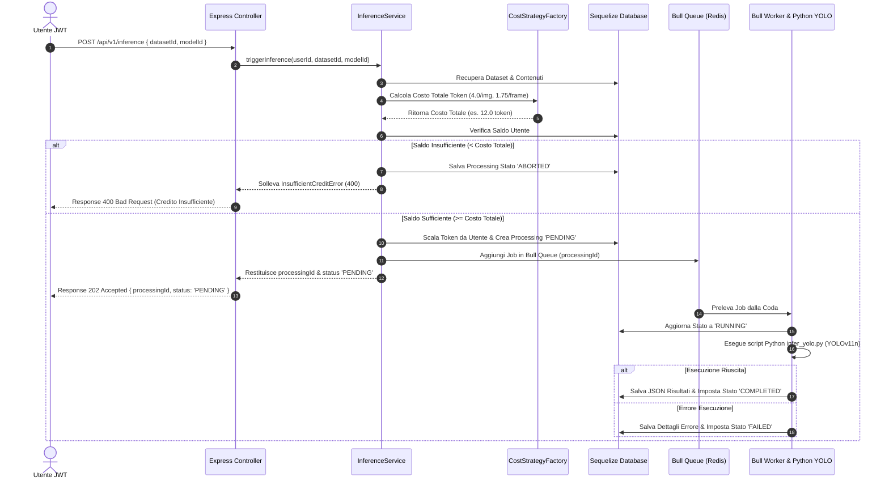

# Backend REST API per Gestione Inferenza ML (YOLOv11n) 🚀

Progetto per l'esame di **Programmazione Avanzata** - Università Politecnica delle Marche (UnivPM).

Sistema backend distribuito sviluppato in **TypeScript / Node.js** ed **Express** per la gestione dell'inferenza Object Detection su immagini e video mediante il modello pre-addestrato **YOLOv11n** (`ultralytics`). Il sistema supporta l'autenticazione tramite JWT firmati con algoritmo **RS256**, la gestione del credito utente sotto forma di token, ed il processamento asincrono in coda con **Bull** e **Redis**.

---

## 🎯 Obiettivo del Progetto

L'obiettivo del sistema è fornire una piattaforma REST in grado di:
1. **Gestire Dataset Utente**: Creazione, aggiornamento, cancellazione logica (`soft delete`) e listing dei dataset.
2. **Gestire i Contenuti (Immagini e Video MP4)**: Upload dei file con verifica del costo in token:
   - **Immagine**: `0.25 token` per file.
   - **Video MP4**: `0.08 token / KB` di dimensione file.
3. **Eseguire l'Inferenza ML (YOLOv11n)**: Accodamento ed elaborazione asincrona via Bull Queue & script Python (`ultralytics` YOLOv11n):
   - **Costo Inferenza Immagine**: `4.0 token / immagine`.
   - **Costo Inferenza Video**: `1.75 token / frame`.
   - Controllo preventivo del saldo token: abort immediato dell'operazione (`ABORTED`) se il saldo è insufficiente.
4. **Monitorare Avanzamento e Risultati**: Tracciamento delle fasi (`PENDING`, `RUNNING`, `FAILED`, `ABORTED`, `COMPLETED`) e restituzione dei dettagli in formato JSON.
5. **Visualizzazione Frame Split**: Generazione dinamica dell'immagine composta divisa a metà (sinistra: frame originale, destra: frame con Bounding Box e etichette classi).
6. **Autenticazione & Gestione Crediti**: Sicurezza basata su token **JWT RS256** (chiave privata/pubblica RSA) e rotta amministrativa per la ricarica dei token utente via email.

---

## 📊 Stato del Progetto rispetto alla Consegna

Di seguito è riportato il resoconto dettagliato sullo stato di avanzamento del progetto rispetto ai requisiti e alle specifiche stabilite per la consegna dell'esame di **Programmazione Avanzata**.

### 🟢 Lavoro Completato (`[x]`)

- [x] **Autenticazione & Gestione Credenziali**:
  - Registrazione e Login utenti con memorizzazione sicura della password tramite hashing `bcryptjs`.
  - Autenticazione basata su token **JWT** firmati con algoritmo **RS256** (coppia di chiavi asimmetriche RSA pubblica/privata).
  - Middleware di controllo ruoli (Utente Standard `USER` vs Amministratore `ADMIN`).
- [x] **Gestione Credito Utente (Sistema di Token)**:
  - Gestione del saldo crediti in token per ciascun utente.
  - Endpoint utente per la verifica del saldo token residuo (`GET /api/v1/users/credit`).
  - Endpoint amministrativo per la ricarica dei token utente specificando l'email (`POST /api/v1/admin/recharge`).
- [x] **Gestione Dataset (CRUD & Soft Delete)**:
  - Creazione dataset con nome, tag ed associazione all'utente proprietario.
  - Listing dei dataset attivi dell'utente autenticato.
  - Modifica dataset con controllo preventivo sulla sovrapposizione/duplicazione del nome.
  - Cancellazione logica dei dataset (`soft delete` tramite Sequelize `paranoid` / campo `deletedAt`).
- [x] **Caricamento Contenuti (Immagini & Video MP4)**:
  - Caricamento file multimediali (Immagini JPG/PNG e Video MP4) legati ad un dataset.
  - Calcolo del costo in token dinamico basato su **Strategy Pattern** (`CostStrategyFactory`):
    - **Immagini**: `0.25 token / file`.
    - **Video MP4**: `0.08 token / KB`.
  - Deduzione immediata dei token dal saldo dell'utente.
- [x] **Inferenza ML Asincrona Multi-Modello (YOLOv8 & YOLOv11 - nano, small, medium)**:
  - Catalogo configurabile di modelli YOLO ammessi (`yolov8n`, `yolov8s`, `yolov8m`, `yolov11n`, `yolov11s`, `yolov11m`).
  - Endpoint dedicato per consultare i modelli supportati e relativi metadati (`GET /api/v1/inference/models`).
  - Validazione rigorosa tramite Zod del parametro `modelId` (default: `yolov11n`) con blocco immediato `400 Bad Request` in caso di modello non supportato.
  - Avvio del processo di inferenza tramite `POST /api/v1/inference`.
  - Controllo preventivo del saldo token per l'inferenza:
    - **Immagini**: `4.0 token / immagine`.
    - **Video MP4**: `1.75 token / frame`.
    - Abort immediato del job (`ABORTED`) e risposta `400 Bad Request` in caso di credito insufficiente.
  - Architettura asincrona a code tramite **Bull Queue** disaccoppiata con **Redis**.
  - Integrazione dello script Python (`infer_yolo.py`) basato su libreria `ultralytics` con caricamento dinamico del modello specificato.
  - Tracciamento dello stato di avanzamento (`PENDING`, `RUNNING`, `COMPLETED`, `FAILED`, `ABORTED`) ed endpoint per la consultazione dei risultati JSON (`GET /api/v1/inference/:id/status`).
- [x] **Visualizzazione Frame Split**:
  - Elaborazione dinamica con `sharp` dell'immagine composta affiancata (sinistra: frame originale, destra: frame con Bounding Box ed etichette).
  - Endpoint REST dedicato per il recupero delle immagini split (`GET /api/v1/inference/:id/frame/:frameIndex`).
- [x] **Design Pattern Formalizzati**:
  - **Singleton**: Connessione Database e gestione/caricamento chiavi RSA.
  - **Strategy & Factory**: Calcolo dinamico del costo di upload e di inferenza per tipo di media.
  - **Repository / Service Layer**: Separazione netta tra Controller, Service e Model.
  - **Chain of Responsibility**: Pipeline di middleware Express per auth, ruoli, validazione ed errori.
  - **Producer-Consumer**: Gestione disaccoppiata della coda Bull su Redis.
- [x] **Containerizzazione & Scripting**:
  - Orchestrazione multi-container con `docker-compose.yml` (App Backend Node/Python, DB PostgreSQL, Coda Redis).
  - Gestione dei retry di connessione al database durante la fase di avvio del container (`docker-compose`).
  - Script di seeding (`npm run seed`) per inizializzare il DB con dati di prova pronti all'uso.
- [x] **Documentazione & Postman**:
  - Diagrammi di architettura in formato Mermaid (Diagramma dei Casi d'Uso e Diagramma di Sequenza).
  - Collezione Postman completa inclusa in `postman/YOLO_Inference_API.postman_collection.json`.
- [x] **Testing Unitario Iniziale**:
  - Test unitari con **Jest** per la validazione dei middleware (`authMiddleware`, `errorHandlerMiddleware`).

---

### 🟡 Lavoro da Fare / Attività Residue (`[ ]`)

- [ ] **Ampliamento Copertura dei Test (Unit & Integration)**:
  - Scrittura di unit test per i Servizi di Business Logic (`AuthService`, `DatasetService`, `ContentService`, `InferenceService`) e per le strategie di costo (`CostStrategy`).
  - Implementazione di test di integrazione/E2E con `supertest` per verificare l'intero ciclo di vita dell'API (Auth, Dataset CRUD, Upload, Inferenza e Credito).
- [ ] **Documentazione Interattiva OpenAPI / Swagger UI**:
  - Integrazione delle librerie `swagger-ui-express` e `swagger-jsdoc` per offrire un'interfaccia UI Swagger su `/api-docs` per il collaudo interattivo degli endpoint REST.
- [ ] **Paginazione & Filtraggio Avanzato**:
  - Aggiunta di parametri di paginazione (`page`, `limit`) e filtri di ricerca (per tag, data o stato del processing) sulle rotte GET di listing dei dataset e dell'inferenza.
- [ ] **Gestione Cleanup & Conservazione dei File**:
  - Sviluppo di una procedura di pulizia automatica (o job di manutenzione) per eliminare i file locali non più referenziati nelle cartelle `uploads/` e `outputs/` in seguito ad un'eliminazione definitiva (`hard delete`).
- [ ] **Pipeline CI/CD (GitHub Actions)**:
  - Definizione del file di workflow `.github/workflows/ci.yml` per l'esecuzione automatica di build TypeScript, linter e test Jest su ogni pull request/push.
- [ ] **Configurazione Standard di Code Style (ESLint & Prettier)**:
  - Integrazione dei file di configurazione `.eslintrc.js` e `.prettierrc` per standardizzare la formattazione del codice tra i membri del team.

---

## 📐 Progettazione & Architettura

### 1. Diagramma dei Casi d'Uso (Use Case Diagram)

```mermaid
usecaseDiagram
  actor Utente as "Utente Autenticato"
  actor Admin as "Amministratore"

  package "YOLO Inference System" {
    usecase UC1 as "Autenticazione (Login/Register)"
    usecase UC2 as "Gestione Dataset (CRUD & Soft Delete)"
    usecase UC3 as "Caricamento Immagine / Video MP4"
    usecase UC4 as "Verifica Preventiva Credito Token"
    usecase UC5 as "Richiesta Inferenza YOLOv11n"
    usecase UC6 as "Monitoraggio Stato Processamento"
    usecase UC7 as "Visualizzazione Frame Split (Originale vs BBox)"
    usecase UC8 as "Consulta Credito Residuo"
    usecase UC9 as "Ricarica Token Utente (Admin)"
  }

  Utente --> UC1
  Utente --> UC2
  Utente --> UC3
  Utente --> UC4
  Utente --> UC5
  Utente --> UC6
  Utente --> UC7
  Utente --> UC8

  Admin --> UC1
  Admin --> UC9
```

---

### 2. Diagramma di Sequenza (Sequence Diagram - Workflow Inferenza)



---

### 🏗️ Design Pattern Utilizzati

Nel progetto sono stati implementati e documentati i seguenti Design Pattern:

1. **Singleton Pattern** (`src/config/database.ts`, `src/config/keys.ts`):
   - Garantisce un'unica istanza globale per la connessione al database Sequelize e per il caricamento/generazione delle chiavi RSA per il token JWT.

2. **Strategy Pattern & Factory Pattern** (`src/strategies/cost.strategy.ts`):
   - **Strategy**: Definisce l'interfaccia `ICostStrategy` con le implementazioni concrete `ImageCostStrategy` e `VideoCostStrategy` per separare e rendere estendibile la logica di calcolo del costo token di upload e di inferenza.
   - **Factory**: La classe `CostStrategyFactory` istanzia la strategia corretta in base al tipo MIME/estensione del file (`image` vs `video`).

3. **Repository / Service Layer Pattern** (`src/services/`, `src/controllers/`):
   - Separa nettamente la logica di business (Services) dalla gestione del protocollo HTTP/REST (Controllers) e dalla persistenza dei dati (Models Sequelize).

4. **Chain of Responsibility / Middleware Pattern** (`src/middlewares/`):
   - I middleware Express (`authMiddleware`, `requireRole`, `validationMiddleware`, `uploadMiddleware`, `errorHandlerMiddleware`) gestiscono in sequenza la validazione dei dati, l'autenticazione JWT RS256, il controllo dei ruoli e la cattura centralizzata delle eccezioni.

5. **Producer-Consumer / Observer Pattern** (`src/queue/`):
   - La gestione della coda **Bull** supportata da **Redis** disaccoppia la ricezione della richiesta HTTP dall'esecuzione pesante del modello ML in Python.

---

## 🐳 Guida all'Avvio con Docker Compose

L'applicazione è interamente containerizzata e progettata per essere eseguita con Docker e Docker Compose, garantendo la totale riproducibilità dell'ambiente di esecuzione e di tutte le dipendenze (PostgreSQL, Redis, Python 3 con librerie PyTorch e YOLOv11n).

Assicurarsi che Docker e Docker Compose siano installati ed in esecuzione sul sistema.

### 1. Avvio dei Container
Nella radice del progetto, eseguire:

```bash
docker-compose up --build
```

Docker Compose avvierà 3 container coordinati:
- **`yolo_postgres`**: Database PostgreSQL (porta esposta all'host: `5433`).
- **`yolo_redis`**: Coda messaggi Redis per Bull (porta esposta all'host: `6379`).
- **`yolo_backend_app`**: Backend Node.js/TypeScript con ambiente Python 3 ed `ultralytics` YOLOv11n pre-installati.

L'API REST sarà disponibile all'indirizzo: `http://localhost:3000`.

### 2. Inizializzazione del Database (Seeding Dati Demo)
Una volta avviati i container, aprire un altro terminale ed eseguire il popolamento del database eseguendo lo script di seed nel container `yolo_backend_app`:

```bash
docker-compose exec app npm run seed
```

Lo script popolerà il database PostgreSQL creando:
- **Admin**: `admin@univpm.it` / `Admin123!` (2000.0 Token)
- **User 1**: `user1@univpm.it` / `User123!` (500.0 Token)
- **User 2**: `user2@univpm.it` / `User123!` (25.0 Token)
- **3 Dataset dimostrativi** pronti all'uso con immagini campione per l'inferenza.

---

## 🧪 Esecuzione dei Test Unitari con Jest

Il progetto include i test unitari per le funzioni di middleware.

Per eseguire i test:
```bash
npm test
```

I test verificheranno:
- `authMiddleware`: Autenticazione JWT RS256, gestione header mancanti, verifica token ed eccezione 401 in caso di token utente esauriti (`tokens <= 0`).
- `errorHandlerMiddleware`: Cattura delle eccezioni personalizzate (`AppError`, `InsufficientCreditError`, `BadRequestError`) e formattazione della risposta JSON.

---

## 📬 Test del Progetto tramite Postman o cURL

È stata inclusa una collezione Postman pronta all'uso nella cartella `postman/YOLO_Inference_API.postman_collection.json`.

### Utenti Pre-configurati (Seed):
- **Admin**: `admin@univpm.it` / `Admin123!` (2000.0 Token)
- **User 1**: `user1@univpm.it` / `User123!` (500.0 Token)
- **User 2**: `user2@univpm.it` / `User123!` (25.0 Token)

### Principali Endpoint REST:

| Metodo | Endpoint | Ruolo | Descrizione |
|---|---|---|---|
| `POST` | `/api/v1/auth/register` | Pubblico | Registrazione nuovo utente |
| `POST` | `/api/v1/auth/login` | Pubblico | Login e restituzione token JWT RS256 |
| `GET` | `/api/v1/users/credit` | `[U]` | Ritorna il saldo token residuo dell'utente |
| `POST` | `/api/v1/admin/recharge` | `[A]` | Ricarica token per un utente via email |
| `POST` | `/api/v1/datasets` | `[U]` | Creazione nuovo dataset vuoto |
| `GET` | `/api/v1/datasets` | `[U]` | Lista dataset attivi dell'utente |
| `PUT` | `/api/v1/datasets/:id` | `[U]` | Modifica dataset (verifica sovrapposizione nome) |
| `DELETE` | `/api/v1/datasets/:id` | `[U]` | Cancellazione logica (`soft delete`) |
| `POST` | `/api/v1/datasets/:id/content` | `[U]` | Upload immagine (0.25 token) o video MP4 (0.08 token/KB) |
| `GET` | `/api/v1/inference/models` | `[U]` | Lista modelli YOLO supportati (v8/v11, nano/small/medium) |
| `POST` | `/api/v1/inference` | `[U]` | Avvio inferenza (modelId opzionale, default `yolov11n`) |
| `GET` | `/api/v1/inference/:id/status` | `[U]` | Stato avanzamento e JSON dettagli se `COMPLETED` |
| `GET` | `/api/v1/inference/:id/frame/:frameIndex` | `[U]` | Immagine split (sinistra: originale, destra: BBox & classi) |

---

## 👥 Crediti & Autori

Sviluppato in coppia per l'esame di **Programmazione Avanzata** (UnivPM).
- Repository GitHub Pubblico: [falappa02/Programmazione_Avanzata](https://github.com/falappa02/Programmazione_Avanzata)
