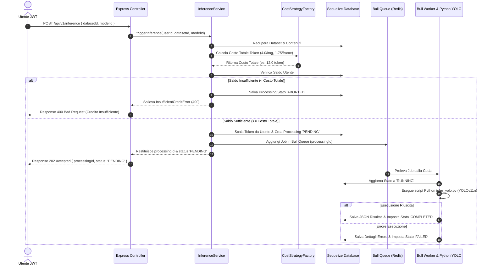

# Backend REST API per Gestione Inferenza ML (YOLOv11n) 🚀

Progetto per l'esame di **Programmazione Avanzata** - Università Politecnica delle Marche (UnivPM).

Sistema backend distribuito sviluppato in **TypeScript / Node.js** ed **Express** per la gestione dell'inferenza Object Detection su immagini e video mediante il modello pre-addestrato **YOLOv11n** (`ultralytics`). Il sistema supporta l'autenticazione tramite JWT firmati con algoritmo **RS256**, la gestione del credito utente sotto forma di token, ed il processamento asincrono in coda con **Bull** e **Redis**.

---

## 🎯 Obiettivo del Progetto

L'obiettivo del sistema è fornire una piattaforma REST in grado di:
1. **Gestire Dataset Utente**: Creazione, aggiornamento, cancellazione logica (`soft delete`) e listing dei dataset.
2. **Gestire i Contenuti (Immagini e Video MP4)**: Upload dei file con verifica del costo in token:
   - **Immagine**: `0.25 token` per file.
   - **Video MP4**: `0.08 token / KB` di dimensione file.
3. **Eseguire l'Inferenza ML (YOLOv11n)**: Accodamento ed elaborazione asincrona via Bull Queue & script Python (`ultralytics` YOLOv11n):
   - **Costo Inferenza Immagine**: `4.0 token / immagine`.
   - **Costo Inferenza Video**: `1.75 token / frame`.
   - Controllo preventivo del saldo token: abort immediato dell'operazione (`ABORTED`) se il saldo è insufficiente.
4. **Monitorare Avanzamento e Risultati**: Tracciamento delle fasi (`PENDING`, `RUNNING`, `FAILED`, `ABORTED`, `COMPLETED`) e restituzione dei dettagli in formato JSON.
5. **Visualizzazione Frame Split**: Generazione dinamica di un'immagine composta divisa a metà (sinistra: frame originale, destra: frame con Bounding Box e etichette classi).
6. **Autenticazione & Gestione Crediti**: Sicurezza basata su token **JWT RS256** (chiave privata/pubblica RSA) e rotta amministrativa per la ricarica dei token utente via email.

---

## 📐 Progettazione & Architettura

### 1. Diagramma dei Casi d'Uso (Use Case Diagram)

```mermaid
usecaseDiagram
  actor Utente as "Utente Autenticato"
  actor Admin as "Amministratore"

  package "YOLO Inference System" {
    usecase UC1 as "Autenticazione (Login/Register)"
    usecase UC2 as "Gestione Dataset (CRUD & Soft Delete)"
    usecase UC3 as "Caricamento Immagine / Video MP4"
    usecase UC4 as "Verifica Preventiva Credito Token"
    usecase UC5 as "Richiesta Inferenza YOLOv11n"
    usecase UC6 as "Monitoraggio Stato Processamento"
    usecase UC7 as "Visualizzazione Frame Split (Originale vs BBox)"
    usecase UC8 as "Consulta Credito Residuo"
    usecase UC9 as "Ricarica Token Utente (Admin)"
  }

  Utente --> UC1
  Utente --> UC2
  Utente --> UC3
  Utente --> UC4
  Utente --> UC5
  Utente --> UC6
  Utente --> UC7
  Utente --> UC8

  Admin --> UC1
  Admin --> UC9
```

---

### 2. Diagramma di Sequenza (Sequence Diagram - Workflow Inferenza)



---

### 🏗️ Design Pattern Utilizzati

Nel progetto sono stati implementati e documentati i seguenti Design Pattern:

1. **Singleton Pattern** (`src/config/database.ts`, `src/config/keys.ts`):
   - Garantisce un'unica istanza globale per la connessione al database Sequelize e per il caricamento/generazione delle chiavi RSA per il token JWT.

2. **Strategy Pattern & Factory Pattern** (`src/strategies/cost.strategy.ts`):
   - **Strategy**: Definisce l'interfaccia `ICostStrategy` con le implementazioni concrete `ImageCostStrategy` e `VideoCostStrategy` per separare e rendere estendibile la logica di calcolo del costo token di upload e di inferenza.
   - **Factory**: La classe `CostStrategyFactory` istanzia la strategia corretta in base al tipo MIME/estensione del file (`image` vs `video`).

3. **Repository / Service Layer Pattern** (`src/services/`, `src/controllers/`):
   - Separa nettamente la logica di business (Services) dalla gestione del protocollo HTTP/REST (Controllers) e dalla persistenza dei dati (Models Sequelize).

4. **Chain of Responsibility / Middleware Pattern** (`src/middlewares/`):
   - I middleware Express (`authMiddleware`, `requireRole`, `validationMiddleware`, `uploadMiddleware`, `errorHandlerMiddleware`) gestiscono in sequenza la validazione dei dati, l'autenticazione JWT RS256, il controllo dei ruoli e la cattura centralizzata delle eccezioni.

5. **Producer-Consumer / Observer Pattern** (`src/queue/`):
   - La gestione della coda **Bull** supportata da **Redis** disaccoppia la ricezione della richiesta HTTP dall'esecuzione pesante del modello ML in Python.

---

## 🐳 Guida all'Avvio con Docker Compose (Consigliata)

Assicurarsi che Docker e Docker Compose siano installati ed in esecuzione sul sistema.

### 1. Avvio del Sistema
Nella radice del progetto, eseguire:

```bash
docker-compose up --build
```

Docker Compose avvierà 3 container coordinati:
- **`yolo_postgres`**: Database PostgreSQL.
- **`yolo_redis`**: Coda messaggi Redis per Bull.
- **`yolo_backend_app`**: Backend Node.js/TypeScript con ambiente Python 3 ed `ultralytics` YOLOv11n pre-installati.

L'API sarà disponibile all'indirizzo: `http://localhost:3000`.

---

## 💻 Avvio in Ambiente Locale (Senza Docker)

1. **Installare le dipendenze Node.js**:
   ```bash
   npm install
   ```

2. **Inizializzare il Database con lo Script di Seed**:
   ```bash
   npm run seed
   ```
   Lo script popolerà il database (SQLite di default per ambiente locale) creando 3 utenti (Admin + 2 User) e **3 dataset dimostrativi** pronti all'uso.

3. **Avviare il Server in Modalità Sviluppo**:
   ```bash
   npm run dev
   ```

---

## 🧪 Esecuzione dei Test Unitari con Jest

Il progetto include i test unitari per le funzioni di middleware.

Per eseguire i test:
```bash
npm test
```

I test verificheranno:
- `authMiddleware`: Autenticazione JWT RS256, gestione header mancanti, verifica token ed eccezione 401 in caso di token utente esauriti (`tokens <= 0`).
- `errorHandlerMiddleware`: Cattura delle eccezioni personalizzate (`AppError`, `InsufficientCreditError`, `BadRequestError`) e formattazione della risposta JSON.

---

## 📬 Test del Progetto tramite Postman o cURL

È stata inclusa una collezione Postman pronta all'uso nella cartella `postman/YOLO_Inference_API.postman_collection.json`.

### Utenti Pre-configurati (Seed):
- **Admin**: `admin@univpm.it` / `Admin123!` (2000.0 Token)
- **User 1**: `user1@univpm.it` / `User123!` (500.0 Token)
- **User 2**: `user2@univpm.it` / `User123!` (25.0 Token)

### Principali Endpoint REST:

| Metodo | Endpoint | Ruolo | Descrizione |
|---|---|---|---|
| `POST` | `/api/v1/auth/register` | Pubblico | Registrazione nuovo utente |
| `POST` | `/api/v1/auth/login` | Pubblico | Login e restituzione token JWT RS256 |
| `GET` | `/api/v1/users/credit` | `[U]` | Ritorna il saldo token residuo dell'utente |
| `POST` | `/api/v1/admin/recharge` | `[A]` | Ricarica token per un utente via email |
| `POST` | `/api/v1/datasets` | `[U]` | Creazione nuovo dataset vuoto |
| `GET` | `/api/v1/datasets` | `[U]` | Lista dataset attivi dell'utente |
| `PUT` | `/api/v1/datasets/:id` | `[U]` | Modifica dataset (verifica sovrapposizione nome) |
| `DELETE` | `/api/v1/datasets/:id` | `[U]` | Cancellazione logica (`soft delete`) |
| `POST` | `/api/v1/datasets/:id/content` | `[U]` | Upload immagine (0.25 token) o video MP4 (0.08 token/KB) |
| `POST` | `/api/v1/inference` | `[U]` | Avvio inferenza YOLOv11n (4.0 token/img, 1.75/frame) |
| `GET` | `/api/v1/inference/:id/status` | `[U]` | Stato avanzamento e JSON dettagli se `COMPLETED` |
| `GET` | `/api/v1/inference/:id/frame/:frameIndex` | `[U]` | Immagine split (sinistra: originale, destra: BBox & classi) |

---

## 👥 Crediti & Autori

Sviluppato in coppia per l'esame di **Programmazione Avanzata** (UnivPM).
- Repository GitHub Pubblico: `Programmazione_Avanzata`
