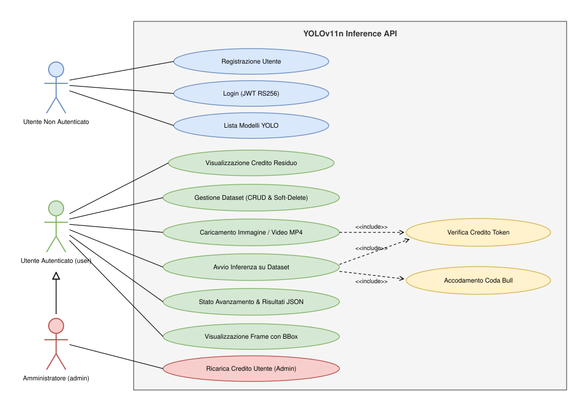
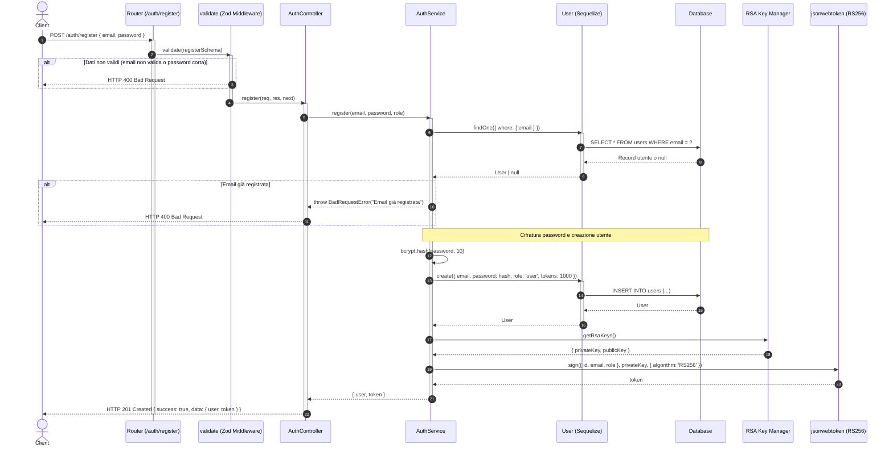
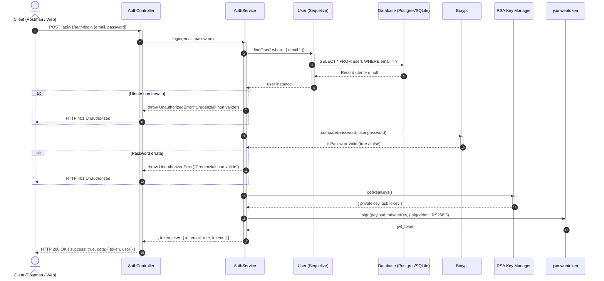
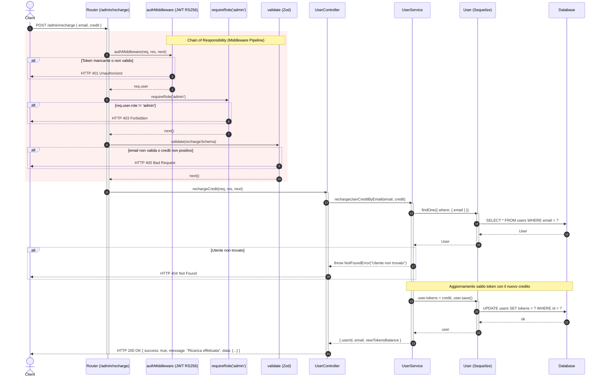
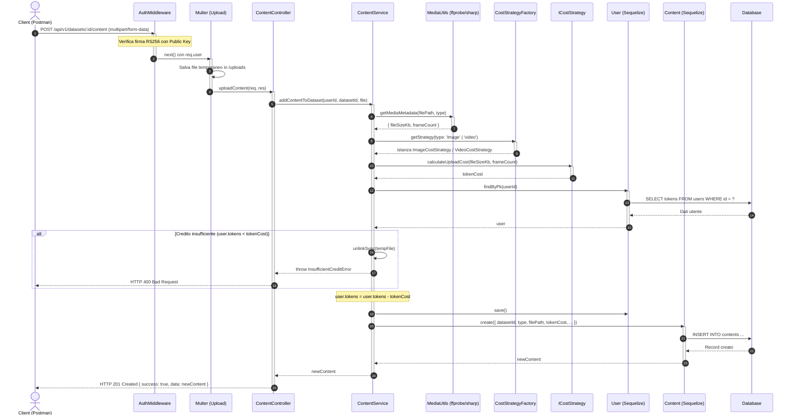
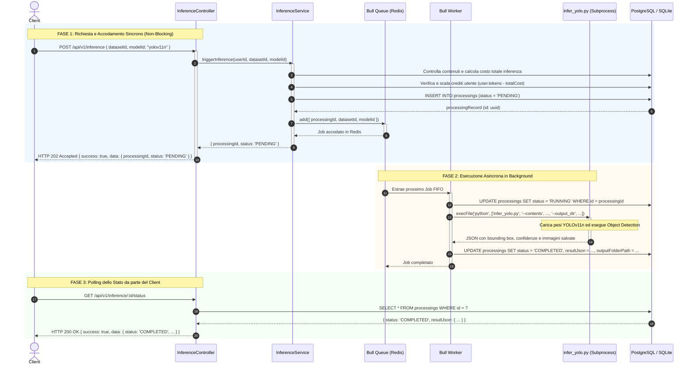
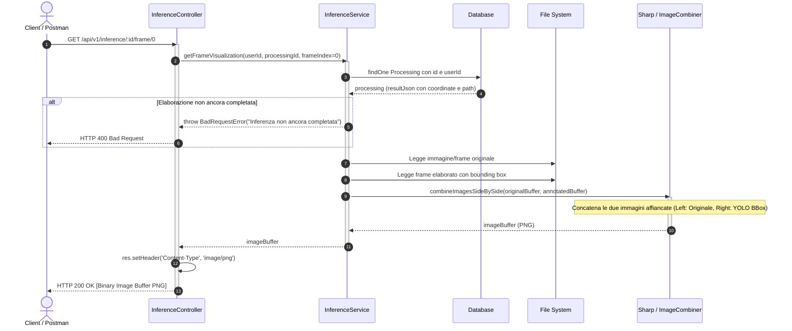

# Programmazione Avanzata — YOLOv11n Inference API

## Indice

| Sezione | Contenuto |
| :--- | :--- |
| [Obiettivo del Progetto](#obiettivo-del-progetto) | Scopo del backend e funzionalità principali |
| [Diagramma dei Casi d'Uso](#diagramma-dei-casi-duso) | Attori del sistema e interazioni principali |
| [Rotte Disponibili](#rotte-disponibili) | Panoramica completa degli endpoint REST |
| ↳ [Autenticazione](#autenticazione) | Registrazione e login con JWT RS256 |
| ↳ [Utenti & Amministrazione](#utenti--amministrazione) | Visualizzazione e ricarica crediti (RBAC) |
| ↳ [Gestione Dataset](#gestione-dataset) | CRUD dataset e soft-delete |
| ↳ [Contenuti Multimediali](#contenuti-multimediali) | Upload immagini/video e Strategy Pattern |
| ↳ [Inferenza YOLO](#inferenza-yolo) | Coda asincrona Bull, status e visualizzazione frame |
| [Design Pattern Implementati](#design-pattern-implementati) | Pattern architetturali con relative motivazioni (*Perché*) |
| [Avvio del Servizio](#avvio-del-servizio) | Esecuzione multi-container con Docker Compose |
| [Testing](#testing) | Postman test suite, test di concorrenza Bull e Jest |
| [Note](#note) | Software, librerie e tecnologie usate |
| [Autore](#autore) | Riferimenti autore e GitHub |

---

## Obiettivo del Progetto

Il progetto implementa un backend RESTful ingegnerizzato in **TypeScript / Express** integrato con un motore di Machine Learning in **Python / PyTorch** per l'esecuzione del modello di Object Detection **Ultralytics YOLOv11n**.

Gli utenti autenticati possono gestire dataset multimediali (immagini fisse e sequenze video MP4), caricare contenuti e richiedere l'elaborazione di inferenza. Per evitare il blocco del server HTTP dovuto al carico computazionale della computer vision, l'esecuzione dei modelli è demandata a una **coda asincrona Bull su Redis**. I consumi e l'accesso alle risorse sono regolati da un'economia a token gestita mediante pattern architetturali.

Le operazioni principali sono:
* **Autenticazione e autorizzazione asimmetrica**: rilascio e verifica di token JWT firmati con algoritmo crittografico **RS256** (coppia di chiavi RSA a 2048 bit). Nel caso di token esauriti (`tokens <= 0`), ogni richiesta autenticata viene rifiutata con `401 Unauthorized`.
* **Controllo degli accessi basato sui ruoli (RBAC)**: distinzione tra utenti standard e amministratori (`admin` e `user`).
* **Gestione Dataset**: organizzazione dei contenuti in collezioni logiche con verifica di non sovrapposizione dei nomi per lo stesso utente, deduplicazione tag tramite `Set<string>` e cancellazione logica (*Soft-Delete*).
* **Upload multimediale con Strategy Pattern**: calcolo polimorfico dei costi in crediti per immagini (`0.25 token`) e video MP4 (`0.08 token/KB`).
* **Pipeline di Inferenza asincrona non-bloccante**: controllo preventivo del credito (`4 token/immagine`, `1.75 token/frame`), accodamento immediato con HTTP `202 Accepted`, elaborazione FIFO tramite worker dedicato e polling dello stato (`PENDING`, `RUNNING`, `COMPLETED`, `FAILED`, `ABORTED`).
* **Ispezione visuale Side-by-Side**: generazione e streaming di immagini composite PNG che affiancano il frame originale (a sinistra) a quello annotato con i Bounding Box e le classi di YOLO (a destra).

---

## Diagramma dei Casi d'Uso

Il diagramma mostra i tre attori del sistema e le operazioni che ciascuno può compiere. L'**Amministratore (`admin`)** eredita tutti i casi d'uso dell'**Utente autenticato (`user`)** e ha accesso esclusivo all'operazione di ricarica del credito token tramite email.



---

## Rotte Disponibili

### Autenticazione

Le **rotte di autenticazione** permettono la registrazione e l'accesso al sistema con rilascio di token JWT firmati in RS256.

| METODO | ROTTA | JWT RICHIESTO | DESCRIZIONE |
| :--- | :--- | :--- | :--- |
| `POST` | `/api/v1/auth/register` | No | Registra un nuovo utente e assegna 1000 token iniziali |
| `POST` | `/api/v1/auth/login` | No | Verifica le credenziali e restituisce un token JWT RS256 |

---

#### POST /api/v1/auth/register

Registra un nuovo utente nel sistema assegnandogli di default il ruolo `user` e un credito di **1000.0 token**. La password viene cifrata in modo sicuro tramite Bcrypt (salt rounds: 10). Al termine restituisce il token JWT pronto all'uso.

**Body richiesta:**
```json
{
  "email": "user1@univpm.it",
  "password": "User123!"
}
```
> La password deve contenere almeno 6 caratteri.

**Errori possibili:**
- `BadRequestError` — Dati della richiesta non validi (Zod validation)
- `BadRequestError` — Utente con questa email già registrato

**Successo:** `201 Created` — Ritorna `{ user, token }`



---

#### POST /api/v1/auth/login

Verifica le credenziali dell'utente tramite comparazione dell'hash Bcrypt. Se corrette, recupera la chiave RSA privata e firma un token JWT con algoritmo RS256 della durata di 24 ore.

**Body richiesta:**
```json
{
  "email": "user1@univpm.it",
  "password": "User123!"
}
```

**Errori possibili:**
- `BadRequestError` — Email o password mancanti nel body
- `UnauthorizedError` — Credenziali non valide (utente non trovato o password errata)

**Successo:** `200 OK` — Ritorna `{ token, user: { id, email, role, tokens } }`



---

### Utenti & Amministrazione

Le **rotte utenti** permettono di consultare il credito residuo e consentono all'amministratore di ricaricare i token di qualsiasi account.

| METODO | ROTTA | JWT RICHIESTO | DESCRIZIONE |
| :--- | :--- | :--- | :--- |
| `GET` | `/api/v1/users/credit` | Sì (`user` / `admin`) | Restituisce il bilancio dei token dell'utente autenticato |
| `POST` | `/api/v1/admin/recharge` | Sì (**solo `admin`**) | Ricarica il credito token di un utente specifico tramite email |

---

#### GET /api/v1/users/credit

Restituisce le informazioni relative ai crediti token ancora a disposizione dell'utente autenticato (estratto dal payload del token JWT).

**Errori possibili:**
- `UnauthorizedError` — Token JWT mancante, scaduto o non valido
- `NotFoundError` — Utente non trovato a database

**Successo:** `200 OK` — Ritorna `{ userId, email, tokens }`

---

#### POST /api/v1/admin/recharge

Imposta il nuovo credito di token per l'account di un utente identificato dalla sua email. Questa operazione è protetta dalla catena di middleware RBAC (`authMiddleware` $\rightarrow$ `requireRole('admin')` $\rightarrow$ `validate(rechargeSchema)`).

**Body richiesta:**
```json
{
  "email": "user1@univpm.it",
  "credit": 1500.0
}
```

**Errori possibili:**
- `UnauthorizedError` — Token mancante o non valido
- `ForbiddenError` — Utente autenticato non possiede il ruolo `admin` (HTTP 403)
- `BadRequestError` — Credito specificato non valido (deve essere un numero positivo)
- `NotFoundError` — Utente destinatario non trovato

**Successo:** `200 OK` — Ritorna `{ userId, email, newTokensBalance }`



---

### Gestione Dataset

Le **rotte dei dataset** consentono agli utenti di raggruppare logicamente i file multimediali da sottoporre all'elaborazione YOLO.

| METODO | ROTTA | JWT RICHIESTO | DESCRIZIONE |
| :--- | :--- | :--- | :--- |
| `POST` | `/api/v1/datasets` | Sì | Crea un nuovo dataset per l'utente loggato |
| `GET` | `/api/v1/datasets` | Sì | Restituisce tutti i dataset non eliminati dell'utente |
| `PUT` | `/api/v1/datasets/:id` | Sì | Aggiorna nome e tag di un dataset esistente |
| `DELETE` | `/api/v1/datasets/:id` | Sì | Cancellazione logica (Soft-Delete) del dataset |

---

#### POST /api/v1/datasets

Crea un nuovo dataset vuoto assegnato all'utente autenticato.

**Body richiesta:**
```json
{
  "name": "Traffic Monitoring Dataset",
  "tags": ["vehicles", "traffic", "cctv"]
}
```

**Errori possibili:**
- `UnauthorizedError` — Token non fornito o non valido
- `BadRequestError` — Nome dataset mancante o non valido (Zod validation)

**Successo:** `201 Created` — Ritorna il record completo del dataset creato

---

#### GET /api/v1/datasets

Restituisce la lista di tutti i dataset appartenenti all'utente che non sono stati contrassegnati come cancellati (`isDeleted = false`), includendo il conteggio dei contenuti associati.

**Successo:** `200 OK` — Ritorna un array di dataset con metadati

---

#### PUT /api/v1/datasets/:id

Modifica il nome e/o i tag di un dataset esistente. L'operazione è permessa solo se il dataset appartiene all'utente richiedente.

**Parametri URL:**
- `id` — UUID del dataset

**Body richiesta:**
```json
{
  "name": "Dataset Traffico Aggiornato",
  "tags": ["urban", "smart-city"]
}
```

**Errori possibili:**
- `NotFoundError` — Dataset non trovato o appartenente a un altro utente

**Successo:** `200 OK` — Ritorna il record del dataset aggiornato

---

#### DELETE /api/v1/datasets/:id

Esegue la cancellazione logica (*Soft-Delete*) impostando il flag `isDeleted = true`. In questo modo la cronologia delle inferenze e i risultati passati rimangono consistenti nel database senza perdita di dati storici.

**Parametri URL:**
- `id` — UUID del dataset

**Successo:** `200 OK` — Ritorna conferma dell'avvenuta eliminazione

---

### Contenuti Multimediali

Le **rotte dei contenuti** gestiscono l'upload di immagini e video all'interno di un dataset, integrando il calcolo dinamico dei costi.

| METODO | ROTTA | JWT RICHIESTO | DESCRIZIONE |
| :--- | :--- | :--- | :--- |
| `POST` | `/api/v1/datasets/:id/content` | Sì | Carica un file (JPG, PNG, MP4) con calcolo costi e detrazione token |

---

#### POST /api/v1/datasets/:id/content

Carica un file multimediale nel dataset specificato tramite payload `multipart/form-data`.
Il sistema:
1. Ispeziona il file estraendo metadati e conteggio frame (se video).
2. Seleziona tramite `CostStrategyFactory` la strategia di costo (`ImageCostStrategy` o `VideoCostStrategy`).
3. Verifica che il saldo dell'utente copra il costo. In caso negativo, il file temporaneo viene cancellato e la richiesta interrotta.
4. Scala i crediti e memorizza il contenuto.

**Parametri URL:**
- `id` — UUID del dataset di destinazione

**Body richiesta** (`multipart/form-data`):
- `file` — File binario (estensioni ammesse: `.jpg`, `.jpeg`, `.png`, `.mp4`)

**Errori possibili:**
- `BadRequestError` — Nessun file allegato o formato non supportato
- `NotFoundError` — Dataset non trovato o eliminato
- `InsufficientCreditError` — Saldo token insufficiente per il caricamento del contenuto

**Successo:** `201 Created` — Ritorna `{ id, datasetId, type, fileSizeKb, frameCount, tokenCost, filePath }`



---

### Inferenza YOLO

Le **rotte di inferenza** costituiscono il nucleo asincrono dell'applicazione: permettono di avviare il rilevamento oggetti con YOLOv11n, controllarne l'avanzamento ed estrarre i frame con i Bounding Box disegnati.

| METODO | ROTTA | JWT RICHIESTO | DESCRIZIONE |
| :--- | :--- | :--- | :--- |
| `GET` | `/api/v1/inference/models` | No | Elenco dei modelli YOLO supportati nel sistema |
| `POST` | `/api/v1/inference` | Sì | Avvia l'inferenza asincrona accodando il task su Bull/Redis |
| `GET` | `/api/v1/inference/:id/status` | Sì | Consulta lo stato e i risultati dell'elaborazione |
| `GET` | `/api/v1/inference/:id/frame/:frameIndex` | Sì | Restituisce il frame Side-by-Side (Originale vs YOLO) in formato PNG |

---

#### GET /api/v1/inference/models

Restituisce l'elenco dei modelli YOLO supportati dall'infrastruttura (consultabile pubblicamente anche prima del login).

**Successo:** `200 OK` — Ritorna `{ supportedModels: ["yolov11n"], defaultModel: "yolov11n" }`

---

#### POST /api/v1/inference

Avvia l'inferenza su tutti i contenuti del dataset selezionato:
1. Calcola il costo totale preventivo (4 token/immagine fissa, 1.75 token/frame video).
2. Effettua il controllo a priori sul saldo utente: se insufficiente, crea un record di audit `ABORTED` e lancia `InsufficientCreditError`.
3. Scala i token, crea un record `Processing` con stato `PENDING` e accoda il job su **Bull/Redis**.
4. **Risponde immediatamente al client con `202 Accepted`**, lasciando libero l'event loop di Node.js.
5. In background, il **Bull Worker** esegue sequenzialmente lo script Python `infer_yolo.py` che carica i pesi YOLOv11 ed effettua l'Object Detection, salvando le annotazioni e portando lo stato a `COMPLETED`.

**Body richiesta:**
```json
{
  "datasetId": "3fa85f64-5717-4562-b3fc-2c963f66afa6",
  "modelId": "yolov11n"
}
```

**Errori possibili:**
- `BadRequestError` — Modello non valido o dataset vuoto
- `NotFoundError` — Dataset non trovato
- `InsufficientCreditError` — Saldo token insufficiente per il costo totale dell'inferenza

**Successo:** `202 Accepted` — Ritorna `{ processingId, status: "PENDING", totalCost }`



---

#### GET /api/v1/inference/:id/status

Permette al client di effettuare il polling sullo stato di un job di elaborazione tramite il suo identificativo (`processingId`).

**Parametri URL:**
- `id` — UUID del record di processing

**Successo:** `200 OK` — Ritorna i dettagli del processing:
- Se `PENDING`: job in attesa nella coda Redis.
- Se `RUNNING`: worker Bull sta eseguendo l'inferenza Python YOLO.
- Se `COMPLETED`: include `resultJson` con bounding box, etichette (classi COCO) e confidenze.
- Se `FAILED`: include `errorType` ed `errorDetails`.

---

#### GET /api/v1/inference/:id/frame/:frameIndex

Restituisce in streaming binario un'immagine composita affiancata (*Side-by-Side*): a sinistra il frame/immagine originale, a destra il frame elaborato con i Bounding Box e le etichette tracciate da YOLO. La composizione grafica è realizzata ad alte prestazioni con la libreria **Sharp**.

**Parametri URL & Query:**
- `id` — UUID del processing
- `frameIndex` — Indice numerico del frame (0 per immagini fisse o primo frame di video)
- `contentId` — *(Opzionale)* Identificativo del contenuto specifico nel dataset

**Successo:** `200 OK` — Buffer binario immagine con header `Content-Type: image/png`



---

## Design Pattern Implementati

**Singleton** — gestisce la connessione al database ([`src/config/database.ts`](src/config/database.ts)) e l'accesso alla coda Bull ([`src/queue/inference.queue.ts`](src/queue/inference.queue.ts)), garantendo un'unica istanza condivisa lungo tutto il ciclo di vita dell'applicazione.  
*Perché:* aprire una nuova connessione a Sequelize o un nuovo connection pool verso Redis/PostgreSQL a ogni richiesta esaurirebbe rapidamente le risorse della macchina; il Singleton centralizza la configurazione, impedisce duplicazioni e assicura l'integrità del connection pooling.

**Strategy** — definisce una famiglia di algoritmi intercambiabili per il calcolo dei costi in crediti dei file multimediali ([`src/strategies/cost.strategy.ts`](src/strategies/cost.strategy.ts)), incapsulati dietro l'interfaccia `ICostStrategy`.  
*Perché:* il costo di upload e di inferenza differisce radicalmente tra immagini statiche (`ImageCostStrategy`) e video MP4 multiframe (`VideoCostStrategy`). Lo Strategy Pattern permette di estendere il sistema (es. aggiungendo stream audio o nuvole di punti 3D) nel rispetto dell'*Open/Closed Principle*, senza modificare i controller o i servizi esistenti.

**Factory Method** — centralizza e disaccoppia la creazione delle strategie di costo ([`CostStrategyFactory`](src/strategies/cost.strategy.ts#L36)) e la generazione tipizzata delle eccezioni applicative ([`ErrorFactory`](src/errors/ErrorFactory.ts)).  
*Perché:* elimina i blocchi condizionali e le istanziazioni dirette (`new ...Error()`) sparse nei vari layer del software: quando i servizi devono determinare il costo di un media o sollevare un errore di dominio (`400 Bad Request`, `401 Unauthorized`, `403 Forbidden`, `404 Not Found`), interrogano le rispettive Factory ottenendo un oggetto consistente e conforme all'*Open/Closed Principle*.

**Chain of Responsibility** — filtra e valida ogni richiesta HTTP in arrivo attraverso una pipeline di middleware Express componibili: autenticazione asimmetrica JWT e verifica credito residuo (`authMiddleware`) $\rightarrow$ controllo ruoli RBAC (`roleMiddleware`) $\rightarrow$ validazione schemi Zod (`validationMiddleware`) $\rightarrow$ logica di business nei controller $\rightarrow$ gestione errori centralizzata (`errorMiddleware`).  
*Perché:* ogni middleware possiede un'unica responsabilità e interrompe immediatamente la catena in caso di errore; i controller restano compatti, concentrati esclusivamente sulla logica di dominio e svincolati dai dettagli di autenticazione e validazione dei parametri.

**Message Queue & Worker (Asynchronous Processing)** — serializza i compiti computazionalmente onerosi di deep learning interponendo una coda Redis con **Bull** tra il server HTTP e lo script Python di YOLO ([`src/queue/inference.worker.ts`](src/queue/inference.worker.ts)).  
*Perché:* l'inferenza di computer vision è bloccante e impegna intensamente CPU e memoria. L'architettura asincrona risponde al client con HTTP `202 Accepted` in pochi millisecondi, mantenendo il server web reattivo, e processa i task in modalità FIFO a concorrenza controllata (`concurrency = 1`), scongiurando crash per *Out of Memory* (OOM).

**Enum Pattern (Type-Safe HTTP Codes)** — formalizza tutti i codici di risposta HTTP standard (`200 OK`, `201 Created`, `202 Accepted`, `400 Bad Request`, ecc.) all'interno dell'enum TypeScript `HttpStatus` ([`src/enums/httpStatus.ts`](src/enums/httpStatus.ts)).  
*Perché:* elimina i "magic numbers" sparsi nei controller e nei middleware, prevenendo errori di battitura a tempo di compilazione e rendendo il codice espressivo e conforme agli standard ingegneristici.

---

## Avvio del Servizio

Requisiti: **Docker** e **Docker Compose** installati sulla macchina.

```bash
# Avvio di tutti i servizi (PostgreSQL, Redis e App Node+Python)
docker compose up --build
```

Il servizio è disponibile su **`http://localhost:3000`**.

Per popolare il database con utenti di test (`admin@univpm.it`, `user1@univpm.it`, `user2@univpm.it`) e **3 dataset diversi** comprensivi di immagini e video MP4 per la demo:
```bash
docker compose exec app npm run seed
```

---

## Testing

Il progetto adotta una strategia di testing multilivello conforme alle specifiche:

### 1. Test Automatizzati dei Middleware con Jest
```bash
docker compose exec app npm test
# oppure in locale: npm test
```
Sono presenti suite di test unitari dedicate in `tests/`:
- [**`tests/middlewares/auth.middleware.test.ts`**](tests/middlewares/auth.middleware.test.ts): verifica il middleware di autenticazione JWT RS256 (rifiuto se header assente, passaggio con token valido, e rifiuto con `401 Unauthorized` quando il credito dell'utente è esaurito `tokens <= 0`).
- [**`tests/middlewares/error.middleware.test.ts`**](tests/middlewares/error.middleware.test.ts): verifica il middleware di gestione centralizzata degli errori (`errorHandlerMiddleware`), controllando la corretta mappatura di `InsufficientCreditError` (400) e delle eccezioni generiche (500).
- [**`tests/errors/error.factory.test.ts`**](tests/errors/error.factory.test.ts) & [**`tests/services/inference.models.test.ts`**](tests/services/inference.models.test.ts): verificano `ErrorFactory` e la validazione dei modelli YOLO supportati.

### 2. Suite di Test Automatizzati Postman
Importare la collezione [**`postman/YOLO_Inference_API.postman_collection.json`**](postman/YOLO_Inference_API.postman_collection.json) in Postman.
- **Chaining Automatico delle Variabili**: gli script nel tab *Tests* estraggono e memorizzano automaticamente `jwt_token`, `admin_jwt_token`, `dataset_id`, `content_id` e `processing_id`.
- **Asserzioni di Contratto**: ogni richiesta verifica lo status code atteso, la conformità dello schema JSON e i tempi di risposta (SLA < 800ms).
- **Negative Testing**: cartella dedicata per verificare il corretto rifiuto con `401 Unauthorized`, `403 Forbidden` e `400 Bad Request`.
- **Collection Runner**: supporta l'esecuzione completa end-to-end con un solo clic.

### 3. Test di Concorrenza Bull (`npm run test:concurrency`)
Verifica il comportamento del sistema quando riceve carichi simultanei:
```bash
docker compose exec app npm run test:concurrency
# oppure in locale: npm run test:concurrency
```
Lo script invia **5 richieste simultanee** di inferenza con `Promise.all`: dimostra che tutte ricevono risposta immediata `202 Accepted` (< 50ms) e mostra il monitoraggio in tempo reale della coda FIFO (1 task in `RUNNING`, 4 in `PENDING`).

---

## Note

### Software Utilizzati
* [Visual Studio Code](https://code.visualstudio.com/) — IDE di sviluppo
* [Docker Desktop](https://www.docker.com/) — Virtualizzazione e orchestrazione dei container
* [Postman](https://www.postman.com/) — Piattaforma per testing e documentazione delle API REST

### Tecnologie Usate
- **Node.js 18 & TypeScript 5** — Runtime JavaScript moderno e linguaggio tipizzato
- **Express.js** — Framework web minimale e performante
- **Sequelize ORM** — Mappatura relazionale per database PostgreSQL e SQLite
- **PostgreSQL 15** — Database relazionale ad alte prestazioni
- **Redis 7 & Bull Queue** — In-memory data store per la gestione della coda asincrona di job
- **Python 3, PyTorch & Ultralytics YOLOv11** — Runtime di computer vision e Object Detection
- **OpenCV & Sharp** — Librerie per decodifica video e composizione grafica Side-by-Side
- **jsonwebtoken (RS256) & crypto** — Crittografia asimmetrica basata su coppia di chiavi RSA 2048-bit
- **bcryptjs** — Hashing unidirezionale sicuro delle password
- **Multer** — Middleware per la gestione dell'upload multipart/form-data
- **Zod** — Schema validation a tempo di compilazione ed esecuzione
- **Jest & Supertest** — Framework di testing automatizzato

---


