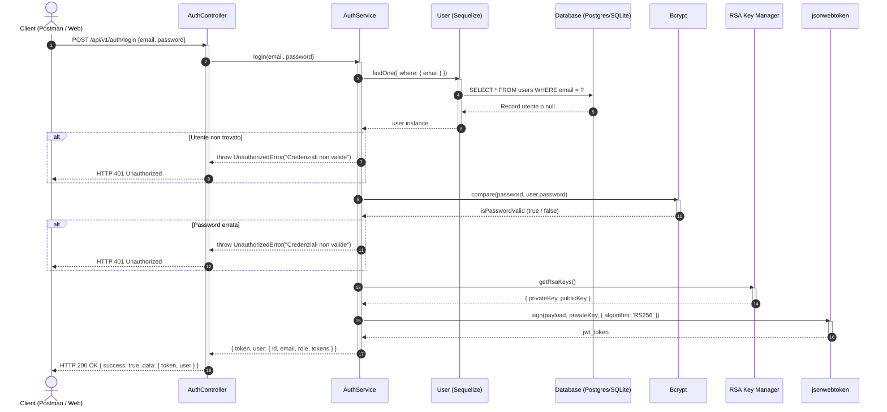
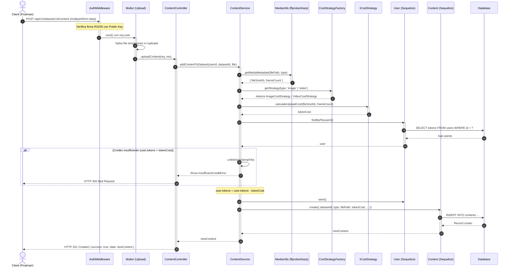
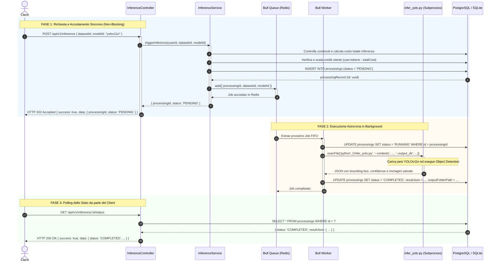
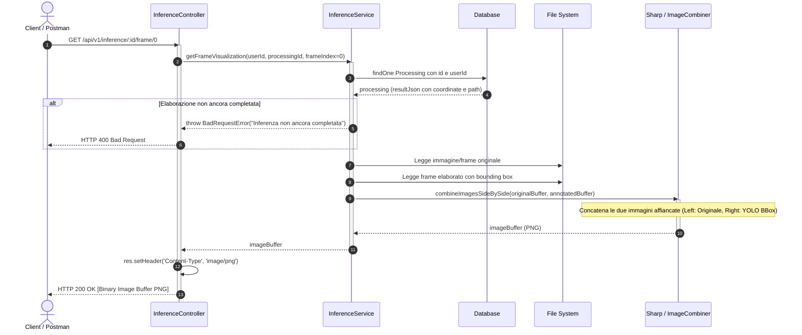

# Diagrammi di Sequenza UML - Rotte Principali

Questo documento contiene i **Diagrammi di Sequenza UML** delle 4 rotte architetturali più significative del progetto, realizzati con sintassi standard **Mermaid**.

I diagrammi possono essere visualizzati direttamente in:
- Qualsiasi visualizzatore Markdown (VS Code, GitHub, GitLab, Obsidian)
- L'editor online ufficiale [Mermaid Live Editor](https://mermaid.live) per esportarli in **PNG**, **SVG** o **PDF** da inserire nella relazione o nelle slide per il docente.

---

## 1. Rotta: `POST /api/v1/auth/login` (Autenticazione Asimmetrica RS256)

Mostra il flusso di verifica credenziali con crittografia hash Bcrypt e firma del token JWT tramite coppia di chiavi RSA a 2048 bit (**RS256**).

---

## 2. Rotta: `POST /api/v1/datasets/:id/content` (Upload con Strategy Pattern)

Illustra l'integrazione del **Design Pattern Strategy & Factory**: il calcolo del costo in crediti varia dinamicamente a seconda che il media caricato sia un'immagine fissa o un video MP4 multiframe.

---

## 3. Rotta: `POST /api/v1/inference` (Trigger Inferenza con Coda Asincrona Bull / Redis)

Questo diagramma cattura la vera architettura asincrona del backend:
1. **Fase sincrona HTTP**: risposta immediata `202 ACCEPTED` al client dopo il prelievo dei token e l'accodamento in Redis.
2. **Fase asincrona Worker**: estrazione FIFO del task da parte del worker Bull ed esecuzione isolata di YOLO in sottoprocesso Python.

---

## 4. Rotta: `GET /api/v1/inference/:id/frame/:index` (Visualizzazione Frame Side-by-Side)

Mostra l'estrazione e composizione visuale in streaming: il backend recupera il frame originale e il frame annotato da YOLO con i Bounding Box, li unisce orizzontalmente con la libreria grafica **Sharp** e restituisce il buffer PNG grezzo al browser o a Postman.

