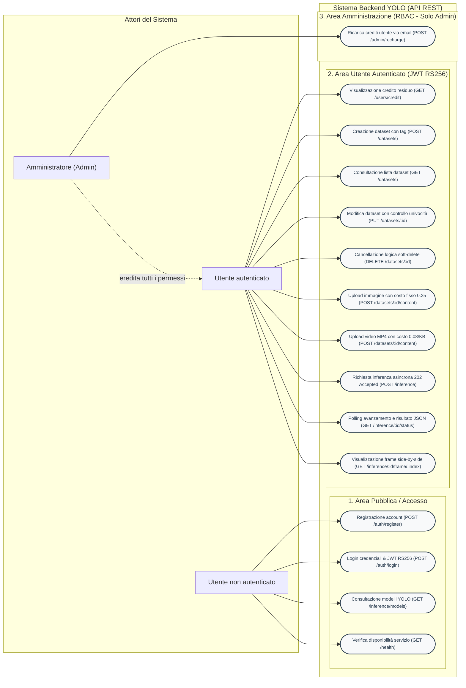

# Diagramma dei Casi d'Uso UML

Questo documento contiene il **Diagramma dei Casi d'Uso UML** del sistema backend per l'inferenza YOLO, realizzato con sintassi standard **Mermaid**.

I casi d'uso sono organizzati secondo i tre livelli di privilegio:
1. **Utente non autenticato** (Area Pubblica / Accesso)
2. **Utente autenticato** (Gestione Dataset, Upload Contenuti, Inferenza YOLO)
3. **Amministratore** (Operazioni riservate RBAC)

---

## Diagramma Mermaid

---

## Descrizione degli Attori e Ruoli

### 1. Utente non autenticato
- Non richiede token JWT.
- **Registrazione** (`POST /api/v1/auth/register`): creazione account con assegnazione iniziale di 1000.0 token.
- **Login** (`POST /api/v1/auth/login`): verifica credenziali con hash Bcrypt e rilascio di token JWT firmato con chiave RSA 2048-bit (RS256).
- **Catalogo Modelli** (`GET /api/v1/inference/models`): consultazione pubblica dei modelli YOLO supportati.
- **Health Check** (`GET /health`): verifica stato di salute del server.

### 2. Utente autenticato (`user`)
- Tutte le rotte sono protette da `authMiddleware` con verifica della firma asimmetrica della chiave pubblica RSA e controllo crediti residui (`tokens > 0`). In caso di token esauriti, l'accesso viene interrotto con `401 Unauthorized`.
- **Credito residuo** (`GET /api/v1/users/credit`): consultazione del saldo token.
- **Gestione Dataset**:
  - `POST /api/v1/datasets`: creazione dataset con nome e tag (lista di stringhe).
  - `GET /api/v1/datasets`: recupero della lista dei dataset non cancellati (`isDeleted = false`).
  - `PUT /api/v1/datasets/:id`: modifica del nome e/o tag con validazione della non-sovrapposizione di nomi per lo stesso utente.
  - `DELETE /api/v1/datasets/:id`: cancellazione logica (*Soft-Delete*).
- **Upload Contenuti Multimediali** (`POST /api/v1/datasets/:id/content`):
  - Immagini JPG/PNG: costo fisso di 0.25 token.
  - Video MP4: costo di 0.08 token per KB caricato.
  - Calcolo dinamico dei costi tramite **Strategy Pattern** e detrazione atomica dei token.
- **Inferenza Machine Learning**:
  - `POST /api/v1/inference`: avvio asincrono con risposta immediata `202 Accepted` e accodamento su Bull/Redis. Costo: 4 token per immagine, 1.75 token per frame video. Annullamento a priori con stato `ABORTED` se il credito è insufficiente.
  - `GET /api/v1/inference/:id/status`: polling sullo stato (`PENDING`, `RUNNING`, `COMPLETED`, `FAILED`, `ABORTED`) e ricezione dei Bounding Box in formato JSON.
  - `GET /api/v1/inference/:id/frame/:frameIndex`: streaming immagine PNG composita affiancata (*Side-by-Side*: originale a sinistra, annotata a destra).

### 3. Amministratore (`admin`)
- Eredita tutti i permessi dell'utente standard.
- Ha accesso esclusivo (`requireRole('admin')`) alla funzione di:
  - **Ricarica Crediti** (`POST /api/v1/admin/recharge`): aggiornamento del saldo crediti di un qualsiasi utente specificandone l'indirizzo email.
